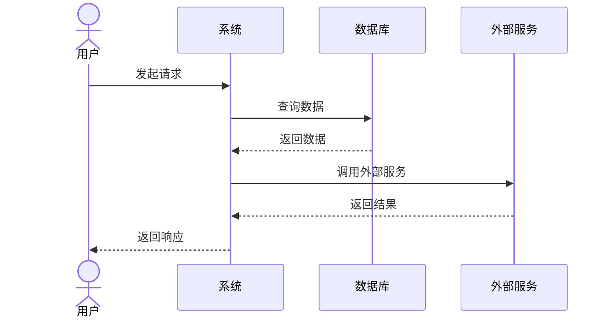

<!--
  Sync Impact Report
  ===================
  Version change: 2.4.0 → 2.5.0 (MINOR: Added language standardization rule)

  Modified principles:
  - N/A (no existing principles modified)

  Added sections:
  - XII. 语言规范 (Language Standardization) - NEW PRINCIPLE
    - 所有项目文档必须使用中文编写
    - 代码注释必须使用中文
    - 明确的例外情况（标识符、日志级别、配置键名等）
    - 文档质量要求和审查检查项

  Removed sections: N/A

  Templates requiring updates:
  - .specify/templates/plan-template.md ✅ (compatible)
  - .specify/templates/spec-template.md ✅ (compatible)
  - .specify/templates/tasks-template.md ✅ (compatible)

  Follow-up TODOs: None
-->

# Project Constitution

> **核心目标**: 构建具备强扩展性、可维护性、可持续性、可迭代性、先进性的软件系统，杜绝历史包袱累积。

---

## Core Principles

### I. 架构卓越 (Architecture Excellence)

**规则**:

**架构参考要求**:
- 架构设计必须参考业界优秀开源项目的设计模式和最佳实践
- 重点学习优秀开源项目的：模块划分、依赖管理、扩展机制、测试策略、文档组织
- 推荐参考项目类型：
  - 大型分布式系统（如 Kubernetes）- 学习微服务编排、插件系统设计
  - 开发工具框架（如 VS Code）- 学习扩展系统、模块化架构
  - 成熟框架生态（如 React）- 学习组件化设计、状态管理
  - 系统编程语言（如 Rust）- 学习错误处理、类型系统设计

**设计原则**:
- 采用领域驱动设计 (DDD)，确保业务逻辑与技术实现分离
- 所有模块必须遵循 SOLID 原则：
  - **S**ingle Responsibility: 单一职责，一个类只做一件事
  - **O**pen/Closed: 对扩展开放，对修改封闭
  - **L**iskov Substitution: 子类可替换父类
  - **I**nterface Segregation: 接口隔离，不强迫实现不需要的方法
  - **D**ependency Inversion: 依赖抽象而非具体实现
- 优先使用组合而非继承，保持代码灵活性
- 新功能必须先进行架构评审，确保与现有系统协调一致

**架构文档要求**:
- 架构决策必须记录在 ADR (Architecture Decision Records) 文档中
- ADR 必须包含：背景 (Context)、决策 (Decision)、后果 (Consequences)、替代方案 (Alternatives)
- 架构图必须使用标准符号（如 C4 Model、UML），保持更新

**理由**: 优秀的架构是系统长期成功的基石。参考经过大规模验证的开源项目设计模式，可避免重复造轮子，确保系统具备应对未来变化的能力。

---

### II. 代码质量与注释 (Code Quality & Documentation)

**规则**:

**注释要求**:
- 所有公共 API、复杂业务逻辑、算法实现必须有清晰的注释
- 注释必须解释"为什么"而非"是什么"
- 使用标准化的文档注释格式：
  - TypeScript/JavaScript: JSDoc
  - Python: Docstrings (Google Style)
  - Rust: Rust Doc Comments
  - Go: Go Doc Comments
- 代码自解释优先：命名清晰、结构合理、减少不必要的注释

**文件头注释模板**:
```
/**
 * @fileoverview 模块简述（一句话描述）
 * @description 详细描述模块的职责和功能
 * @author 作者
 * @created 创建日期
 * @dependencies 关键依赖列表
 * @example 使用示例（可选）
 */
```

**函数注释模板**:
```
/**
 * 函数功能简述
 * @param paramName - 参数描述
 * @returns 返回值描述
 * @throws 可能抛出的异常
 * @example
 * // 使用示例
 * functionName(arg1, arg2);
 */
```

**代码审查清单**:
- [ ] 命名是否清晰、有意义、符合命名规范
- [ ] 函数是否单一职责，长度是否合理（≤50 行）
- [ ] 是否有必要的注释，注释是否准确
- [ ] 是否有重复代码，是否需要抽取公共组件
- [ ] 是否有潜在的性能问题或安全漏洞
- [ ] 测试用例是否覆盖主要场景

**理由**: 好的注释和文档是代码可维护性的关键。团队成员流动时，良好的文档能确保知识传承，降低维护成本。

---

### III. 业务操作日志记录 (Business Operation Logging)

**规则**:

**日志记录要求**:
- 所有关键业务操作必须记录结构化日志
- 日志格式必须为 JSON，便于日志系统解析和检索
- 日志必须包含以下基础字段：

```json
{
  "timestamp": "2026-03-15T10:30:00.000Z",
  "level": "INFO",
  "traceId": "abc123-def456",
  "spanId": "span789",
  "operation": "resource.action",
  "operator": {
    "userId": "user_001",
    "username": "john_doe",
    "ip": "192.168.1.100"
  },
  "target": {
    "type": "resource_type",
    "id": "resource_id",
    "name": "resource_name"
  },
  "result": {
    "status": "success|failure",
    "duration": 1500,
    "message": "操作结果描述"
  },
  "context": {
    "version": "1.0.0",
    "environment": "production"
  }
}
```

**敏感数据处理**:
- 敏感数据必须脱敏处理后再记录
- 脱敏规则：
  - 密码: `******`
  - 手机号: `138****1234`
  - 邮箱: `j***@example.com`
  - 身份证: `110***********1234`
  - 银行卡: `6222****1234`

**日志级别规范**:
| 级别 | 用途 | 示例 |
|------|------|------|
| DEBUG | 调试信息，仅开发环境 | 变量值、执行路径 |
| INFO | 关键业务操作 | 用户登录、数据导出、文件上传 |
| WARN | 潜在问题，不影响功能 | 重试成功、降级处理、配置缺失 |
| ERROR | 错误异常，影响功能 | API 失败、数据库错误、超时 |

**日志追踪要求**:
- 所有请求必须生成唯一 traceId，贯穿整个调用链
- 跨服务调用必须传递 traceId
- 日志存储必须满足审计合规要求（保留期 ≥ 90 天）

**理由**: 完善的日志记录是运维监控、问题排查、安全审计的基础，是生产环境稳定运行的保障。

---

### IV. 可扩展性优先 (Extensibility First)

**规则**:

**插件化架构要求**:
- 系统必须采用插件化/模块化架构，新功能可独立添加而不影响现有功能
- 插件必须具备以下特性：
  - 独立开发、测试、部署
  - 热插拔支持（无需重启系统）
  - 版本化演进，向后兼容
  - 沙箱隔离，故障不影响主系统

**接口抽象要求**:
- 所有外部依赖必须通过接口抽象，便于替换和测试
- 接口设计原则：
  - 单一职责，接口职责清晰
  - 高内聚低耦合
  - 避免暴露实现细节

**配置管理要求**:
- 配置与代码分离，支持运行时配置调整
- 配置项必须有默认值和验证规则
- 敏感配置必须加密存储
- 支持多环境配置（开发、测试、预发、生产）

**API 设计要求**:
- API 设计必须考虑向后兼容，版本化演进
- API 版本规范：`/api/v1/resource`
- 破坏性变更必须升级主版本号
- API 文档必须同步更新

**扩展性决策检查**:
- 新功能是否能以插件形式实现？
- 是否需要修改现有代码？
- 是否会影响现有功能？
- 是否有更简单的实现方式？

**理由**: 可扩展的架构能从容应对业务变化，降低新功能开发成本，延长系统生命周期。

---

### V. 可维护性与可持续性 (Maintainability & Sustainability)

**规则**:

**代码复杂度控制**:
- 单个函数不超过 50 行，超过必须拆分
- 单个文件不超过 500 行，超过必须拆分
- 嵌套层级不超过 4 层，超过必须重构
- 圈复杂度不超过 10，超过必须简化

**重复代码处理**:
- 重复代码超过 3 处必须抽取为公共组件
- 使用静态分析工具检测重复代码
- 公共组件必须有独立测试和文档

**重构触发条件**:
| 信号 | 触发条件 | 行动 |
|------|----------|------|
| 代码异味 | 函数过长、重复代码、深层嵌套 | 立即重构 |
| 测试困难 | 需要大量 mock 或 setup | 重构以提高可测试性 |
| 频繁修改 | 同一模块频繁修改 | 考虑拆分或重新设计 |
| Bug 高发 | 同一模块多次出现 Bug | 代码审查和重构 |

**技术债务管理**:
- 技术债务必须记录在 Issues 系统，标签：`tech-debt`
- 每个技术债务必须包含：描述、影响范围、优先级、预估工作量
- 每次 Sprint 必须预留 20% 时间处理技术债务
- 每次迭代结束必须进行代码审查和重构

**依赖管理**:
- 依赖库必须定期更新（至少每季度一次）
- 安全漏洞必须及时修复（高危 24h 内，中危 7d 内）
- 新增依赖必须评估：社区活跃度、维护状态、许可证、安全性

**理由**: 可维护性决定了系统的长期成本。持续的技术债务管理确保系统不会因历史包袱而停滞不前。

---

### VI. 持续迭代与技术先进性 (Continuous Iteration & Technical Advancement)

**规则**:

**敏捷开发要求**:
- 采用敏捷开发方法，小步快跑，快速交付价值
- 迭代周期：2 周（可根据团队调整）
- 每个迭代必须有明确的目标和可交付成果

**迭代周期规范**:
| 阶段 | 时间 | 产出 |
|------|------|------|
| 规划 | 第 1 天 | 迭代目标、任务分配 |
| 开发 | 第 2-8 天 | 可工作代码 |
| 测试 | 第 9 天 | 测试报告 |
| 评审 | 第 10 天 | 演示、回顾、下迭代规划 |

**技术选型标准**:
| 评估维度 | 权重 | 评估标准 |
|----------|------|----------|
| 社区活跃度 | 30% | Stars、Issue 响应、Release 频率 |
| 长期支持 | 25% | 维护团队、版本策略、向后兼容性 |
| 生态成熟度 | 20% | 插件、工具链、文档质量 |
| 学习成本 | 15% | 团队熟悉度、学习资源、培训成本 |
| 性能表现 | 10% | Benchmark、生产案例 |

**技术复盘要求**:
- 每个迭代结束必须进行技术复盘
- 复盘内容：技术决策回顾、问题总结、改进建议
- 改进建议必须有负责人和时间表

**技术创新原则**:
- 鼓励技术创新，但有成熟方案时优先选择成熟方案
- 新技术引入必须经过 POC 验证
- 新技术必须有回退方案

**理由**: 持续迭代确保产品不断进化，技术先进性保证系统不会因技术落后而被淘汰。

---

### VII. 零技术债务容忍 (Zero Technical Debt Tolerance)

**规则**:

**代码质量门禁**:
- 新代码必须通过静态分析检查，零警告
- 所有代码必须通过单元测试覆盖，核心模块覆盖率不低于 **90%**
- 代码审查必须通过至少 1 人 Approve
- CI 流水线必须全部通过才能合并

**技术债务识别**:
| 类型 | 识别方式 | 示例 |
|------|----------|------|
| 代码异味 | 静态分析工具 | 过长函数、重复代码 |
| 架构问题 | 架构评审 | 循环依赖、职责不清 |
| 测试不足 | 覆盖率报告 | 缺少边界测试、异常测试 |
| 文档缺失 | 文档审查 | 缺少 API 文档、设计文档 |
| 安全漏洞 | 安全扫描 | SQL 注入、XSS |

**技术债务处理流程**:
```
发现 → 记录 → 评估 → 排期 → 处理 → 验证 → 关闭
  ↓        ↓        ↓        ↓        ↓        ↓
自动检测  Issue   优先级   Sprint   代码     测试
工具扫描  系统    评定     分配     修改     验证
```

**技术债务优先级**:
| 优先级 | 定义 | 处理时限 |
|--------|------|----------|
| P0 | 影响系统稳定或安全 | 立即处理 |
| P1 | 影响开发效率或质量 | 本 Sprint 处理 |
| P2 | 影响可维护性 | 下 Sprint 处理 |
| P3 | 优化建议 | 有空闲时处理 |

**重大变更要求**:
- 重大架构变更必须有迁移计划和回滚策略
- 迁移计划必须包含：影响范围、迁移步骤、验证方法、回滚步骤
- 必须有灰度发布计划，逐步放量

**理由**: 技术债务是软件项目的隐形杀手。零容忍政策确保系统始终保持健康状态，避免债务累积导致的系统崩溃。

---

### VIII. 需求明确性优先 (Requirement Clarity First)

**规则**:

**需求明确性要求**:
- 任何功能开发前，需求必须完全明确、具体、详细
- 模糊需求禁止进入实现阶段
- 遇到需求不明确或模糊时，必须优先向利益相关者提问澄清
- 不得基于假设进行设计或实现

**模糊需求处理流程**:
```
发现模糊点 → 提出问题(10个以内) → 提供 2-4 个建议方案 → 利益相关者选择 → 明确需求
     ↓            ↓              ↓                    ↓             ↓
  标记疑问     书面提问      包含利弊分析          确认签字      更新文档
```

**建议方案模板**:
```markdown
### 方案 A: [方案名称]

**描述**: [方案详细描述]

**优点**:
- 优点 1
- 优点 2

**缺点**:
- 缺点 1
- 缺点 2

**适用场景**: [描述适用场景]

**技术复杂度**: 低/中/高

**工作量预估**: X 人天
```

**业务术语定义模板**:
```markdown
### [术语名称]

**定义**: [明确的定义]

**示例**:
- 示例 1
- 示例 2

**非示例** (什么不是该术语):
- 非示例 1

**相关术语**: [关联的其他术语]

**备注**: [补充说明]
```

**用户故事验收标准**:
- 每个用户故事必须包含明确的验收标准 (Acceptance Criteria)
- 验收标准必须遵循 Given-When-Then 格式（BDD 行为驱动开发）

**Given-When-Then 格式规范**:
```gherkin
Feature: [功能名称]

  Scenario: [正常场景]
    Given [初始状态/前置条件]
    When [用户操作/触发事件]
    Then [预期结果/系统响应]

  Scenario: [边界场景]
    Given [边界条件]
    When [边界操作]
    Then [边界结果]

  Scenario: [异常场景]
    Given [异常前置条件]
    When [触发异常的操作]
    Then [异常处理结果]
```

**需求完整性检查清单**:
- [ ] 功能描述是否清晰完整？
- [ ] 验收标准是否使用 Given-When-Then 格式？
- [ ] 边界条件是否定义？（数据范围、并发限制、超时处理）
- [ ] 错误场景是否定义？（异常处理、失败重试、降级策略）
- [ ] 性能要求是否定义？（响应时间、吞吐量、资源占用）
- [ ] 业务术语是否有明确定义？
- [ ] 利益相关者是否确认签字？

**需求变更管理**:
- 需求变更必须通过正式流程，不得口头变更
- 变更请求必须评估：
  - 对现有架构的影响（是否需要架构调整）
  - 对进度的影响（是否影响交付时间）
  - 对已有功能的影响（是否需要回归测试）
- 变更影响评估报告必须经利益相关者确认后才能执行变更

**需求变更评估模板**:
```markdown
## 变更请求

**变更内容**: [描述变更内容]

**变更原因**: [描述变更原因]

## 影响评估

**架构影响**: [评估对架构的影响]
- 是否需要架构调整: 是/否
- 影响模块: [列出受影响的模块]

**进度影响**: [评估对进度的影响]
- 预估工作量: X 人天
- 是否影响交付时间: 是/否

**功能影响**: [评估对已有功能的影响]
- 影响功能: [列出受影响的功能]
- 是否需要回归测试: 是/否

## 审批

- [ ] 技术负责人审批
- [ ] 产品负责人审批
- [ ] 利益相关者确认
```

**理由**: 需求模糊是项目返工和延期的主要根源。明确的验收标准、完整的边界定义、规范的变更流程是高质量交付的前提。追求"一次做对"，最大限度减少返工。

---

### IX. 测试驱动开发 (Test-Driven Development) **[强制要求]**

**规则**:

**测试强制要求**:
- **所有功能必须同时提供单元测试和集成测试**
- 测试代码与功能代码同步开发，禁止功能上线后再补测试
- 测试未通过的功能代码禁止合并到主分支

**单元测试要求**:
| 项目类型 | 单元测试框架 | 覆盖率要求 |
|----------|--------------|------------|
| Go | `testing` + `testify` | ≥ 80% |
| TypeScript/JavaScript | `Jest` / `Vitest` | ≥ 80% |
| Python | `pytest` | ≥ 80% |
| Rust | `cargo test` | ≥ 80% |
| 其他语言 | 主流测试框架 | ≥ 80% |

**单元测试范围**:
- 所有公共函数/方法必须有对应的单元测试
- 边界条件测试（空值、极限值、非法输入）
- 异常路径测试（错误处理、异常抛出）
- Mock 外部依赖，确保测试隔离性

**集成测试要求**:
| 测试类型 | 说明 | 频率 |
|----------|------|------|
| API 集成测试 | 验证 API 端点完整流程 | 每个 PR |
| 数据库集成测试 | 验证数据持久化正确性 | 每个 PR |
| 服务集成测试 | 验证服务间通信 | 每个 PR |
| E2E 测试 | 验证关键用户流程 | 发布前 |

**集成测试范围**:
- 所有 API 端点必须有集成测试
- 数据库操作必须有集成测试（使用测试数据库）
- 外部服务调用必须有集成测试（使用 Mock Server 或测试环境）
- 关键业务流程必须有端到端测试

**测试文件组织**:
```
tests/
├── unit/                    # 单元测试
│   ├── models/             # 模型单元测试
│   ├── services/           # 服务单元测试
│   └── utils/              # 工具函数单元测试
├── integration/             # 集成测试
│   ├── api/                # API 集成测试
│   ├── database/           # 数据库集成测试
│   └── services/           # 服务集成测试
└── e2e/                     # 端到端测试
    └── user_flows/         # 用户流程测试
```

**测试命名规范**:
```
# 单元测试
Test{FunctionName}_{Scenario}_{ExpectedResult}
# 示例: TestParseConfig_ValidJSON_ReturnsConfig

# 集成测试
Test{Feature}_{UserAction}_{ExpectedResult}
# 示例: TestUserRegistration_ValidInput_ReturnsSuccess
```

**测试先行原则 (TDD)**:
- **Red**: 先编写失败的测试
- **Green**: 编写最小代码使测试通过
- **Refactor**: 重构代码，保持测试通过
- 测试代码提交时必须明确标注测试状态（预期失败/已通过）

**测试门禁**:
```yaml
# CI 流水线测试门禁
- 单元测试必须全部通过
- 单元测试覆盖率必须达标
- 集成测试必须全部通过
- 无测试的功能代码禁止合并
```

**测试报告要求**:
- 每次测试运行必须生成测试报告
- 测试报告必须包含：通过率、覆盖率、失败详情
- 测试报告存档至少 30 天

**理由**: 测试是代码质量的保障。单元测试确保模块正确性，集成测试确保系统协同正确性。没有测试的代码是不可维护的代码。

---

### X. 开发流程规范 (Development Workflow Specification) **[强制要求]**

**规则**:

本原则定义了从设计到交付的完整开发流程，所有功能开发必须严格遵循。

---

#### 阶段一：设计阶段 (Design Phase) **[进入编码前必须完成]**

**1.1 User Story 要求**:

每个功能必须定义完整的 User Story，包含以下要素：

```markdown
### User Story: [功能名称]

**作为** [用户角色]
**我想要** [功能目标]
**以便于** [业务价值]

**验收标准 (Acceptance Criteria)**:
- [ ] AC1: [具体验收条件]
- [ ] AC2: [具体验收条件]

**优先级**: P1/P2/P3
**故事点**: X
```

**1.2 Use Case 要求**:

每个 User Story 必须包含详细的 Use Case 文档：

```markdown
### Use Case: [用例名称]

**主执行者**: [执行者角色]

**前置条件**:
- 前置条件 1
- 前置条件 2

**主成功场景**:
1. 用户执行动作 A
2. 系统响应 B
3. 用户执行动作 C
4. 系统返回结果 D

**替代场景**:
- 3a. [异常情况]: 系统提示错误，返回步骤 1

**后置条件**:
- 成功后系统状态变化

**异常处理**:
- 异常类型 1: 处理方式
- 异常类型 2: 处理方式

**业务规则**:
- 规则 1: [具体规则]
- 规则 2: [具体规则]
```

**1.3 业务流程设计要求**:

每个功能必须绘制详细的业务流程图：

```markdown
### 业务流程图: [功能名称]

**泳道图/流程图**: (使用 Mermaid 或其他标准格式)



**流程说明**:
- 步骤 1: 详细说明
- 步骤 2: 详细说明

**数据流**:
- 输入数据: [数据结构]
- 输出数据: [数据结构]

**状态转换**:
- 初始状态 → 中间状态 → 最终状态
```

**1.4 测试用例和测试计划要求**:

每个功能必须提供完整的测试用例和测试计划：

```markdown
### 测试计划: [功能名称]

**测试范围**: [明确测试边界]

**测试类型**:
- [ ] 单元测试
- [ ] 集成测试
- [ ] E2E 测试

**测试环境**:
- 开发环境: [配置]
- 测试环境: [配置]

**测试数据准备**:
- 数据 1: [说明]
- 数据 2: [说明]

---

### 测试用例清单

#### 单元测试用例

| 用例ID | 测试项 | 输入 | 预期输出 | 优先级 |
|--------|--------|------|----------|--------|
| UT-001 | [测试项] | [输入] | [预期] | P1 |
| UT-002 | [测试项] | [输入] | [预期] | P1 |

#### 集成测试用例

| 用例ID | 测试场景 | 前置条件 | 操作步骤 | 预期结果 | 优先级 |
|--------|----------|----------|----------|----------|--------|
| IT-001 | [场景] | [前置] | [步骤] | [预期] | P1 |
| IT-002 | [场景] | [前置] | [步骤] | [预期] | P1 |

#### E2E 测试用例

| 用例ID | 用户旅程 | 起点 | 操作步骤 | 终点 | 优先级 |
|--------|----------|------|----------|------|--------|
| E2E-001 | [旅程] | [起点] | [步骤] | [终点] | P1 |
```

**设计阶段检查清单**:
- [ ] User Story 完整且验收标准明确
- [ ] Use Case 覆盖主成功场景和替代场景
- [ ] 业务流程图清晰，包含异常处理分支
- [ ] 测试用例覆盖所有场景
- [ ] 测试计划明确测试范围和环境
- [ ] 设计文档经团队评审通过

---

#### 阶段二：编码阶段 (Coding Phase) **[严格遵循]**

**2.1 编码纪律**:

- **严格按需求和方案编码**：不得擅自偏离设计文档
- **一次一个功能**：完成一个功能/接口后再开始下一个
- **即时测试**：编码完成后立即执行单元测试
- **自我修复**：发现问题立即修复，不得累积

**2.2 单一功能开发流程**:

```
┌─────────────────────────────────────────────────────────────┐
│                    单一功能开发流程                           │
├─────────────────────────────────────────────────────────────┤
│  1. 编写功能代码                                              │
│     ↓                                                        │
│  2. 编写单元测试代码                                          │
│     ↓                                                        │
│  3. 执行单元测试                                              │
│     ├── 通过 → 进入步骤 4                                     │
│     └── 失败 → 修复代码 → 返回步骤 3                          │
│     ↓                                                        │
│  4. 代码审查 (自我审查)                                       │
│     ├── 通过 → 功能验证完成                                   │
│     └── 问题 → 修复代码 → 返回步骤 3                          │
│     ↓                                                        │
│  5. 提交代码 (附测试报告)                                     │
│     ↓                                                        │
│  6. 进入下一个功能开发                                        │
└─────────────────────────────────────────────────────────────┘
```

**2.3 功能验证标准**:

| 检查项 | 要求 | 验证方式 |
|--------|------|----------|
| 代码规范 | 无静态分析警告 | Linter 检查 |
| 单元测试 | 100% 通过 | 测试运行 |
| 测试覆盖率 | ≥ 80% | 覆盖率报告 |
| 功能正确性 | 满足验收标准 | 手动验证 |
| 代码审查 | 自我审查通过 | Checklist |

**2.4 编码阶段检查清单**:

每个功能编码完成后必须验证：

- [ ] 代码符合设计文档要求
- [ ] 单元测试全部通过
- [ ] 测试覆盖率达标
- [ ] 无静态分析警告
- [ ] 代码有清晰注释
- [ ] 自我审查通过

**2.5 禁止行为**:

- ❌ 跳过单元测试直接进入下一个功能
- ❌ 累积多个问题后批量修复
- ❌ 未经验证就提交代码
- ❌ 偏离设计文档自行发挥

---

#### 阶段三：集成测试阶段 (Integration Testing Phase) **[所有功能编码完成后]**

**3.1 集成测试前置条件**:

- 所有功能单元测试通过
- 所有功能代码已合并
- 测试环境已准备就绪
- 测试数据已准备

**3.2 集成测试流程**:

```
┌─────────────────────────────────────────────────────────────┐
│                    集成测试流程                               │
├─────────────────────────────────────────────────────────────┤
│  1. 按集成测试计划执行测试                                    │
│     ↓                                                        │
│  2. 记录测试结果                                              │
│     ├── 通过 → 进入下一个测试用例                             │
│     └── 失败 → 进入步骤 3                                     │
│     ↓                                                        │
│  3. 问题定位与修复                                            │
│     ├── 修复 → 返回步骤 1 (重测)                              │
│     └── 无法修复 → 升级处理                                   │
│     ↓                                                        │
│  4. 所有测试用例执行完成                                      │
│     ↓                                                        │
│  5. 生成测试报告                                              │
└─────────────────────────────────────────────────────────────┘
```

**3.3 问题修复原则**:

- **立即修复**：发现问题后立即定位和修复，不得延后
- **回归测试**：修复后重新执行相关测试用例
- **影响评估**：评估修复对其他功能的影响

**3.4 测试报告要求**:

所有功能修复完成后，必须在当前需求文件夹下生成测试报告：

```markdown
# 测试报告: [功能名称]

**生成时间**: YYYY-MM-DD HH:mm:ss
**测试环境**: [环境说明]
**测试人员**: [测试人员]

## 测试概况

| 指标 | 数值 |
|------|------|
| 测试用例总数 | X |
| 通过数 | X |
| 失败数 | X |
| 通过率 | X% |

## 单元测试报告

**覆盖率**: X%

| 模块 | 测试用例数 | 通过 | 失败 | 覆盖率 |
|------|------------|------|------|--------|
| 模块A | X | X | X | X% |
| 模块B | X | X | X | X% |

## 集成测试报告

| 用例ID | 测试场景 | 结果 | 备注 |
|--------|----------|------|------|
| IT-001 | [场景] | ✅ 通过 | - |
| IT-002 | [场景] | ❌ 失败 | [原因] |

## 问题记录

| 问题ID | 描述 | 严重程度 | 状态 | 修复时间 |
|--------|------|----------|------|----------|
| BUG-001 | [描述] | High | 已修复 | X min |
| BUG-002 | [描述] | Medium | 已修复 | X min |

## 测试结论

- [ ] 所有测试用例通过
- [ ] 功能满足验收标准
- [ ] 可以进入发布流程

**签字确认**:
- 测试人员: ________ 日期: ________
- 技术负责人: ________ 日期: ________
```

**3.5 测试报告存储位置**:

```
specs/[###-feature-name]/
├── spec.md              # 需求规格
├── plan.md              # 实施计划
├── tasks.md             # 任务列表
├── test-report.md       # 测试报告 ⬅️ 存放位置
└── contracts/           # API 契约
```

**3.6 集成测试阶段检查清单**:

- [ ] 所有集成测试用例执行完成
- [ ] 发现的问题全部修复
- [ ] 回归测试通过
- [ ] 测试报告已生成
- [ ] 测试报告存放在需求文件夹下
- [ ] 团队评审通过

---

#### 开发流程总览

```
┌──────────────────────────────────────────────────────────────────────────┐
│                           开发流程总览                                     │
├──────────────────────────────────────────────────────────────────────────┤
│                                                                          │
│  ┌─────────────────┐    ┌─────────────────┐    ┌─────────────────┐      │
│  │   设计阶段       │ →  │   编码阶段       │ →  │  集成测试阶段    │      │
│  └─────────────────┘    └─────────────────┘    └─────────────────┘      │
│                                                                          │
│  输入:                   输入:                   输入:                   │
│  - 业务需求              - 设计文档              - 完成的代码            │
│                         - 测试用例              - 测试计划              │
│                                                                          │
│  输出:                   输出:                   输出:                   │
│  - User Story           - 功能代码              - 测试报告              │
│  - Use Case             - 单元测试              - 问题修复记录          │
│  - 业务流程图           - 测试通过证明                                   │
│  - 测试用例                                                              │
│  - 测试计划                                                              │
│                                                                          │
│  门禁:                   门禁:                   门禁:                   │
│  - 设计评审通过          - 单元测试通过          - 所有测试通过          │
│  - 测试计划完整          - 覆盖率达标            - 测试报告已生成        │
│                                                                          │
└──────────────────────────────────────────────────────────────────────────┘
```

**理由**: 规范的开发流程是高质量交付的保障。设计阶段确保需求明确、测试就绪；编码阶段确保代码质量、即时验证；集成测试阶段确保系统完整、问题归零。三阶段严格把控，杜绝质量风险。

---

### XI. 工作流程自动化偏好 (Workflow Automation Preferences)

**规则**:

本原则定义了开发过程中的命令执行自动化偏好，提升开发效率。

**1. 低风险命令自动执行**:

以下类型的 bash 命令可自动执行，**无需用户确认**：

| 命令类型 | 示例 | 风险等级 |
|----------|------|----------|
| 信息查询 | `ls`, `cat`, `head`, `tail`, `pwd`, `which` | 无风险 |
| Git 只读操作 | `git status`, `git log`, `git diff`, `git branch`, `git show` | 无风险 |
| 文件搜索 | `find`, `grep`, `rg`, `fd` | 无风险 |
| 系统信息 | `uname`, `date`, `whoami`, `echo` | 无风险 |
| 项目构建 | `npm run build`, `go build`, `cargo build` | 低风险 |
| 依赖安装 | `npm install`, `go mod tidy`, `pip install` | 低风险 |
| 测试运行 | `npm test`, `go test`, `pytest` | 低风险 |
| 代码格式化 | `npm run lint`, `gofmt`, `prettier` | 低风险 |
| 文档生成 | `npm run docs`, `cargo doc` | 低风险 |

**2. 高风险命令需要确认**:

以下类型的命令**必须经过用户确认**：

| 命令类型 | 示例 | 风险等级 | 说明 |
|----------|------|----------|------|
| 文件删除 | `rm -rf`, `rmdir` | 高风险 | 不可恢复 |
| Git 强制操作 | `git push --force`, `git reset --hard` | 高风险 | 可能丢失数据 |
| 数据库操作 | `DROP TABLE`, `TRUNCATE` | 高风险 | 数据丢失 |
| 系统配置 | `chmod`, `chown`, 修改系统文件 | 高风险 | 影响系统安全 |
| 网络发布 | `npm publish`, `docker push` | 高风险 | 影响外部系统 |
| 环境变量 | 修改 `.env`, `export` 敏感信息 | 高风险 | 安全风险 |
| 分支操作 | `git push`, `git checkout`, 创建/删除分支 | 中风险 | 影响远程仓库 |
| 提交操作 | `git commit`, `git merge` | 中风险 | 变更历史 |

**3. 自动执行原则**:

- **效率优先**: 低风险命令直接执行，减少交互中断
- **安全兜底**: 高风险命令必须确认，防止意外损失
- **上下文判断**: 同一命令在不同上下文可能有不同风险等级
- **用户覆盖**: 用户明确授权的命令类型可自动执行

**4. 命令风险判断流程**:

```
收到命令请求
    ↓
是否在低风险列表中？
    ├── 是 → 自动执行
    └── 否 → 是否在高风险列表中？
              ├── 是 → 请求用户确认
              └── 否 → 根据上下文判断
                        ├── 涉及删除/修改 → 请求确认
                        ├── 涉及发布/推送 → 请求确认
                        └── 其他 → 自动执行
```

**5. 快速参考**:

```bash
# ✅ 自动执行 (无需确认)
ls -la
git status
npm install
go test ./...
cat README.md
grep -r "pattern" src/

# ⚠️ 需要确认
git push
git commit -m "message"
rm -rf node_modules
npm publish
```

**理由**: 自动化低风险操作可以显著提升开发效率，减少不必要的交互中断。同时，对高风险操作保持确认机制，确保关键变更得到用户明确授权，平衡效率与安全。

---

### XII. 语言规范 (Language Standardization) **[强制要求]**

**规则**:

本原则定义了项目中所有文本内容的语言使用规范，确保团队沟通一致和知识传承。

**1. 文档语言要求**:

- **所有项目文档必须使用中文编写**，包括但不限于：
  - 需求文档（spec.md、User Story、Use Case）
  - 设计文档（plan.md、ADR、架构图说明）
  - 任务文档（tasks.md）
  - 测试文档（测试计划、测试报告）
  - README、CONTRIBUTING 等项目说明文档
  - API 文档、接口说明文档
  - 会议纪要、技术复盘记录

**2. 代码注释语言要求**:

- **所有代码注释必须使用中文**，包括但不限于：
  - 文件头注释（@fileoverview、模块说明）
  - 函数/方法注释（@param、@returns、@throws）
  - 行内注释（解释复杂逻辑、算法思路）
  - 类型/结构体注释（@typedef、struct 说明）
  - 测试用例注释（测试目的、场景说明）

**3. 例外情况**:

以下场景**允许或必须使用英文**：

| 场景 | 语言 | 说明 |
|------|------|------|
| 代码标识符 | 英文 | 变量名、函数名、类名、类型名等 |
| 日志级别 | 英文 | DEBUG、INFO、WARN、ERROR |
| 日志字段名 | 英文 | timestamp、traceId、operation 等 |
| 配置文件键名 | 英文 | YAML/JSON/TOML 的 key |
| 错误码/状态码 | 英文 | HTTP 状态码、自定义错误码 |
| 第三方库/框架 API | 原语言 | 调用外部库时的参数和返回值 |
| Git 提交信息 | 中文 | 遵循团队约定，本项目要求中文 |
| 国际化字符串 | 英文 key | i18n 的 key 必须使用英文 |

**4. 注释内容规范**:

- 注释内容必须解释"为什么"而非"是什么"
- 复杂算法必须用中文说明核心思路
- 涉及业务逻辑的注释必须清晰表达业务含义
- 示例代码中的注释也必须使用中文

**5. 文档质量要求**:

- 中文表达应准确、简洁、专业
- 避免中英混杂（技术术语除外）
- 专业术语首次出现时可附带英文原文，如：领域驱动设计 (Domain-Driven Design, DDD)
- 标点符号使用中文全角标点

**6. 审查检查项**:

代码审查时必须验证：
- [ ] 所有新增文档是否使用中文
- [ ] 所有新增注释是否使用中文
- [ ] 是否有不必要的中英混杂
- [ ] 技术术语是否有明确定义

**理由**: 统一使用中文编写文档和注释，确保团队成员（尤其是中文母语开发者）能够快速理解项目意图和设计思路，降低沟通成本，提高协作效率。同时，明确的例外规则避免了在必须使用英文的场景下产生混淆。

---

## Quality Gates

### 代码提交门禁
- [ ] 静态分析零警告
- [ ] 单元测试通过
- [ ] 集成测试通过（如有）
- [ ] 代码审查通过
- [ ] 文档已更新

### 合并门禁
- [ ] CI 流水线全部通过
- [ ] 单元测试覆盖率 ≥ 80%
- [ ] 集成测试全部通过
- [ ] 代码审查 ≥ 1 人 Approve
- [ ] 无未解决的冲突

### 发布门禁
- [ ] 所有测试通过（单元、集成、E2E）
- [ ] 测试报告已生成并评审通过
- [ ] 性能测试通过
- [ ] 安全扫描通过
- [ ] 发布说明已更新
- [ ] 回滚预案已准备

---

## Appendix: Templates & Checklists

### ADR 模板
```markdown
# ADR-[编号]: [决策标题]

## Status
[Proposed | Accepted | Deprecated | Superseded]

## Context
[描述背景和问题]

## Decision
[描述决策内容]

## Consequences
[描述决策后果]

### 正面影响
- 影响 1

### 负面影响
- 影响 1

## Alternatives Considered
[描述考虑过的替代方案及拒绝理由]
```

### User Story 模板
```markdown
### User Story: [功能名称]

**作为** [用户角色]
**我想要** [功能目标]
**以便于** [业务价值]

**验收标准**:
- [ ] AC1: [具体验收条件]
- [ ] AC2: [具体验收条件]

**优先级**: P1/P2/P3
**故事点**: X
```

### Use Case 模板
```markdown
### Use Case: [用例名称]

**主执行者**: [执行者角色]

**前置条件**:
- 前置条件 1

**主成功场景**:
1. 步骤 1
2. 步骤 2

**替代场景**:
- 2a. [异常情况]: 处理方式

**后置条件**:
- 条件 1

**异常处理**:
- 异常类型: 处理方式

**业务规则**:
- 规则 1: 具体规则
```

### 测试计划模板
```markdown
### 测试计划: [功能名称]

**测试范围**: [明确测试边界]

**测试类型**:
- [ ] 单元测试
- [ ] 集成测试
- [ ] E2E 测试

**测试环境**:
- 开发环境: [配置]
- 测试环境: [配置]

**测试数据准备**:
- 数据 1: [说明]

---

### 测试用例清单

| 用例ID | 测试项 | 输入 | 预期输出 | 优先级 |
|--------|--------|------|----------|--------|
| UT-001 | [测试项] | [输入] | [预期] | P1 |
```

### 测试报告模板
```markdown
# 测试报告: [功能名称]

**生成时间**: YYYY-MM-DD HH:mm:ss
**测试环境**: [环境说明]
**测试人员**: [测试人员]

## 测试概况

| 指标 | 数值 |
|------|------|
| 测试用例总数 | X |
| 通过数 | X |
| 失败数 | X |
| 通过率 | X% |

## 单元测试报告

**覆盖率**: X%

## 集成测试报告

| 用例ID | 测试场景 | 结果 | 备注 |
|--------|----------|------|------|
| IT-001 | [场景] | ✅ 通过 | - |

## 问题记录

| 问题ID | 描述 | 严重程度 | 状态 | 修复时间 |
|--------|------|----------|------|----------|
| BUG-001 | [描述] | High | 已修复 | X min |

## 测试结论

- [ ] 所有测试用例通过
- [ ] 功能满足验收标准
- [ ] 可以进入发布流程

**签字确认**:
- 测试人员: ________ 日期: ________
- 技术负责人: ________ 日期: ________
```

### 代码审查清单
```markdown
## 代码审查清单

### 基础检查
- [ ] 代码能正常运行
- [ ] 无明显 bug
- [ ] 无安全漏洞

### 代码质量
- [ ] 命名清晰有意义
- [ ] 函数单一职责
- [ ] 无重复代码
- [ ] 注释必要且准确

### 测试
- [ ] 有单元测试
- [ ] 有集成测试（针对 API/数据库操作）
- [ ] 测试覆盖主要场景
- [ ] 边界条件已测试

### 文档
- [ ] API 文档已更新
- [ ] README 已更新（如需要）
```

### 测试清单
```markdown
## 功能测试清单

### 单元测试
- [ ] 公共函数/方法已覆盖
- [ ] 边界条件已测试
- [ ] 异常路径已测试
- [ ] Mock 隔离正确

### 集成测试
- [ ] API 端点已测试
- [ ] 数据库操作已测试
- [ ] 外部服务调用已测试
- [ ] 关键业务流程已测试

### 测试质量
- [ ] 测试命名清晰
- [ ] 测试独立可重复
- [ ] 测试快速可靠
- [ ] 测试报告已生成
```

### 技术复盘模板
```markdown
# 迭代 [编号] 技术复盘

## 技术决策回顾
| 决策 | 结果 | 经验教训 |
|------|------|----------|
| 决策 1 | 成功/失败 | 经验教训 |

## 问题总结
| 问题 | 原因 | 解决方案 | 状态 |
|------|------|----------|------|
| 问题 1 | 原因 | 方案 | 已解决/进行中 |

## 改进建议
| 建议 | 负责人 | 截止日期 |
|------|--------|----------|
| 建议 1 | @xxx | YYYY-MM-DD |
```

---

## Governance

### 宪法修订流程
1. 提出修订提案，说明理由和影响范围
2. 团队评审和讨论
3. 达成共识后更新宪法版本
4. 同步更新相关模板和文档

### 版本控制规则
- **MAJOR**: 原则删除或根本性重新定义
- **MINOR**: 新增原则或实质性扩展
- **PATCH**: 措辞澄清、格式调整、数值微调

### 合规检查
- 所有 PR 必须通过宪法原则检查
- 架构决策必须符合原则要求
- 定期审计系统架构与技术债务状态（每季度至少一次）

### 宪法执行监督
- 每次迭代回顾时检查宪法执行情况
- 违反宪法原则的代码变更必须整改
- 重大违规必须记录并跟踪处理

---

**Version**: 2.5.0 | **Ratified**: 2026-03-15 | **Last Amended**: 2026-03-29