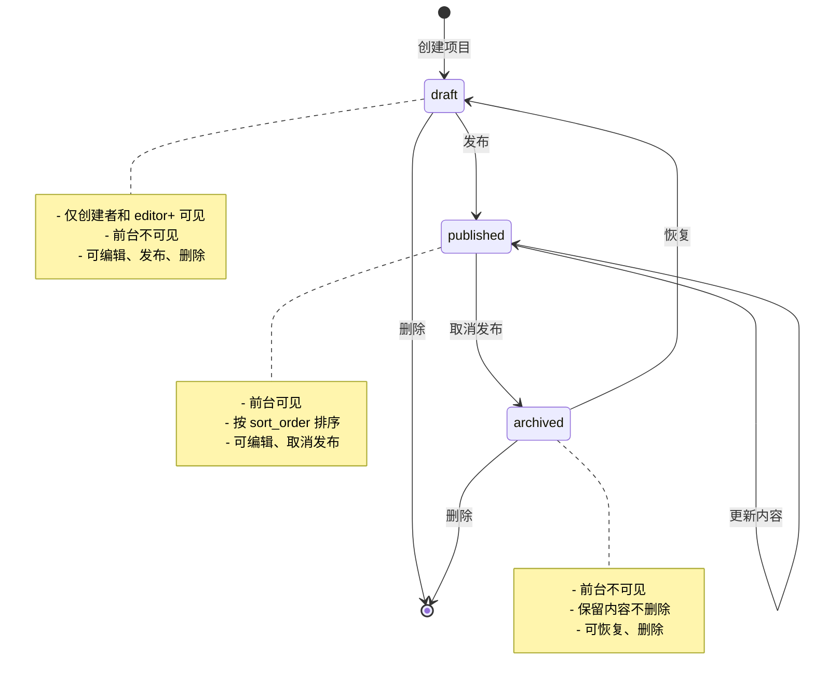

# Design: 后台项目管理 — Projects CMS

**Created**: 2026-04-10
**Status**: Draft
**Branch**: `004-admin-cms`

---

## 概述

前台 `/projects` 页面的项目数据当前是硬编码在 Astro 组件中的。本设计为项目添加完整的后台管理能力，采用独立内容类型（独立于文章系统），复用已有的 CMS 管理架构和编辑器组件。

---

## 1. 数据库设计

### 1.1 projects 表

新建 `projects` 表，参考 `posts` 表结构，包含项目专属字段：

```sql
CREATE TABLE projects (
  id TEXT PRIMARY KEY,
  title TEXT NOT NULL,
  slug TEXT NOT NULL UNIQUE,
  description TEXT,                          -- 一句话简介（列表页展示）
  cover_image_id TEXT REFERENCES media(id),  -- 封面图
  content TEXT NOT NULL,                     -- 富文本详细介绍
  status TEXT NOT NULL DEFAULT 'draft',      -- draft | published | archived
  featured INTEGER NOT NULL DEFAULT 0,       -- 是否推荐
  demo_url TEXT,                             -- 在线演示链接
  source_url TEXT,                           -- 源码链接
  sort_order INTEGER NOT NULL DEFAULT 0,     -- 排序权重
  view_count INTEGER NOT NULL DEFAULT 0,
  seo_title TEXT,
  seo_description TEXT,
  seo_keywords TEXT,
  author_id TEXT NOT NULL REFERENCES users(id),
  created_at TEXT NOT NULL DEFAULT (CURRENT_TIMESTAMP),
  updated_at TEXT NOT NULL DEFAULT (CURRENT_TIMESTAMP),
  published_at TEXT
);
```

### 1.2 project_tags 表

关联项目和标签（复用现有 tags 表）：

```sql
CREATE TABLE project_tags (
  project_id TEXT NOT NULL REFERENCES projects(id),
  tag_id TEXT NOT NULL REFERENCES tags(id),
  PRIMARY KEY (project_id, tag_id)
);
```

### 1.3 数据迁移

新增迁移文件 `scripts/db-migrate.mjs` 中添加版本：

```sql
CREATE TABLE IF NOT EXISTS projects (...)
CREATE TABLE IF NOT EXISTS project_tags (...)
```

### 1.4 Drizzle Schema

在 `src/lib/db/schema.ts` 中新增：

```typescript
export const projects = sqliteTable('projects', { ... });
export const projectTags = sqliteTable('project_tags', { ... });

export const projectsRelations = relations(projects, ({ one, many }) => ({
  author: one(users, { fields: [projects.authorId], references: [users.id] }),
  coverImage: one(media, { fields: [projects.coverImageId], references: [media.id] }),
  projectTags: many(projectTags),
}));

export const projectTagsRelations = relations(projectTags, ({ one }) => ({
  project: one(projects, { fields: [projectTags.projectId], references: [projects.id] }),
  tag: one(tags, { fields: [projectTags.tagId], references: [tags.id] }),
}));

export type Project = typeof projects.$inferSelect;
export type NewProject = typeof projects.$inferInsert;
```

### 1.5 状态机定义

项目状态与文章保持一致：`draft`（草稿）→ `published`（已发布）→ `archived`（已归档）



**状态转换规则**：

| 当前状态 | 允许操作 | 目标状态 | API 端点 | 权限要求 |
|----------|----------|----------|----------|----------|
| `draft` | 发布 | `published` | `POST /api/admin/projects/:id/publish` | editor+ |
| `published` | 取消发布 | `archived` | `POST /api/admin/projects/:id/unpublish` | editor+ |
| `archived` | 恢复 | `draft` | `POST /api/admin/projects/:id/restore` | editor+ |
| `draft` | 删除 | — | `DELETE /api/admin/projects/:id` | editor+ / 作者 |
| `archived` | 删除 | — | `DELETE /api/admin/projects/:id` | editor+ / 作者 |
| `any` | 更新内容 | `any`（不变） | `PUT /api/admin/projects/:id` | editor+ / 作者 |

**状态转换副作用**：

| 转换 | 副作用 |
|------|--------|
| `draft` → `published` | 设置 `publishedAt = now`，记录审计日志 |
| `published` → `archived` | 记录审计日志 |
| `archived` → `draft` | 记录审计日志 |
| 删除（任意状态） | 同时删除关联的 `project_tags` 记录，记录审计日志 |

**前台可见性**：

| 状态 | 列表页可见 | 详情页可见 | API 返回 |
|------|------------|------------|----------|
| `draft` | ❌ | ❌ | ❌ |
| `published` | ✅ | ✅ | ✅ |
| `archived` | ❌ | ❌ | ❌ |

**浏览次数（view_count）更新机制**：

- **触发时机**：用户访问项目详情页 `GET /projects/[slug]` 时调用 `POST /api/projects/:slug/view`
- **实现方式**：前端在页面 `onMount` 或 `useEffect` 中发送一次 view 请求，不阻塞页面渲染
- **防刷策略**：后端基于 IP 去重，同一 IP 24 小时内对同一项目仅计一次（使用 SQLite 轻量缓存表或内存 Set）
- **写入策略**：异步写入，view API 快速返回（不阻塞页面渲染），view_count 更新在后台完成
- **API 行为**：检查 IP + 项目 ID + 时间窗口，未命中则 `UPDATE projects SET view_count = view_count + 1 WHERE id = ?`
- **前台展示**：项目详情页可选择显示浏览次数（与文章保持一致的展示风格）

---

## 2. 后端 API

### 2.1 服务层 `src/lib/services/project.service.ts`

新建项目服务，参考 `post.service.ts` 模式：

| 函数 | 说明 |
|------|------|
| `createProject(data, authorId)` | 创建项目 |
| `getProjectById(id)` | 按 ID 查询 |
| `getProjectBySlug(slug)` | 按 slug 查询（前台用） |
| `listProjects({ status, page, pageSize, keyword })` | 分页列表查询 |
| `updateProject(id, data)` | 更新项目 |
| `publishProject(id)` | 发布（draft → published） |
| `unpublishProject(id)` | 取消发布（published → archived） |
| `restoreProject(id)` | 恢复（archived → draft） |
| `deleteProject(id)` | 删除项目 |
| `getPublicProjects({ featured })` | 前台查询（仅 published，支持 featured 过滤） |
| `incrementViewCount(id)` | 增加浏览次数（+1） |

所有写操作（创建、更新、删除、状态转换）均需记录审计日志到 `audit_log` 表。

### 2.2 API 路由

**管理 API**（需要认证 + 权限）：

| 方法 | 路径 | 说明 | 权限 |
|------|------|------|------|
| GET | `/api/admin/projects` | 列表查询（分页/筛选） | editor+ |
| GET | `/api/admin/projects/:id` | 获取单个项目 | editor+ |
| POST | `/api/admin/projects` | 创建项目 | editor+ |
| PUT | `/api/admin/projects/:id` | 更新项目 | editor+ |
| DELETE | `/api/admin/projects/:id` | 删除项目 | editor+ |
| POST | `/api/admin/projects/:id/publish` | 发布 | editor+ |
| POST | `/api/admin/projects/:id/unpublish` | 取消发布 | editor+ |
| POST | `/api/admin/projects/:id/restore` | 恢复归档 | editor+ |

**公开 API**（前台使用）：

| 方法 | 路径 | 说明 |
|------|------|------|
| GET | `/api/projects` | 获取已发布项目列表 |
| GET | `/api/projects/:slug` | 获取单个已发布项目详情 |
| POST | `/api/projects/:slug/view` | 增加浏览次数 |

### 2.3 API 响应格式

复用已有 API 响应格式：

```json
// 列表
{
  "data": {
    "items": [...],
    "total": 10,
    "page": 1,
    "pageSize": 20
  }
}

// 单个
{
  "data": { ...project }
}

// 错误
{
  "error": "PROJECT_NOT_FOUND",
  "message": "项目不存在"
}
```

---

## 3. 后台管理前端

### 3.1 侧边栏

在 `src/admin/components/layout/Sidebar.tsx` 中增加"项目"导航项：

```
仪表盘
文章
页面
项目  ← 新增
分类
标签
媒体
用户
审计日志
设置
```

图标使用 Lucide React 的 `FolderCode` 或 `Package`。

### 3.2 项目列表页 `src/admin/pages/projects.tsx`

复用 `posts/index.tsx` 的模式：

- 搜索框（按标题搜索）
- 状态筛选器：全部 / 草稿 / 已发布 / 已归档
- 表格展示：标题、状态、推荐标记、创建时间、更新时间
- 操作列：编辑、发布/取消发布、恢复、删除
- 顶部"新建项目"按钮

### 3.3 项目编辑页 `src/admin/pages/projects/edit.tsx`

复用 `posts/edit.tsx` 的编辑器组件（TipTap 编辑器）。

**表单结构**：

```
┌──────────────────────────────────────┐
│ 项目名称 [*必填]                     │
│ [_________________________________]  │
├──────────────────────────────────────┤
│ Slug [*必填]                         │
│ [_________________________________]  │
├──────────────────────────────────────┤
│ 一句话简介                           │
│ [_________________________________]  │
├──────────────────────────────────────┤
│ 封面图                               │
│ [+ 选择图片] 或 [当前封面图预览]      │
├──────────────────────────────────────┤
│ 在线演示 URL                         │
│ [_________________________________]  │
├──────────────────────────────────────┤
│ 源码 URL                             │
│ [_________________________________]  │
├──────────────────────────────────────┤
│ 标签                                 │
│ [tag1] [tag2] [+ 添加]               │
├──────────────────────────────────────┤
│ SEO 标题                             │
│ [_________________________________]  │
├──────────────────────────────────────┤
│ SEO 描述                             │
│ [_________________________________]  │
├──────────────────────────────────────┤
│ 推荐                                 │
│ [○] 设为推荐项目                    │
└──────────────────────────────────────┘

┌──────────────────────────────────────┐
│ 项目详细介绍 [*必填]                  │
│                                      │
│ [TipTap 富文本编辑器]                │
│                                      │
│                                      │
└──────────────────────────────────────┘
```

### 3.4 Astro 包装页面

- `src/pages/admin/projects.astro` — 列表页
- `src/pages/admin/projects/new.astro` — 新建页
- `src/pages/admin/projects/[id]/edit.astro` — 编辑页

---

## 4. 前台展示

### 4.1 项目列表页 `src/pages/projects/index.astro`

**改造前**：硬编码数据
**改造后**：调用 `GET /api/projects` 获取已发布项目

布局保持现有卡片网格不变，数据从 API 获取：

```
标题、描述、标签 → 从数据库查询
demoUrl、sourceUrl → 从数据库查询
封面图 → 从 media 表关联查询
```

### 4.2 项目详情页 `src/pages/projects/[slug].astro`

新建项目详情页，展示单个项目的完整信息：

```
┌────────────────────────────────────────┐
│ [封面图]                               │
│                                        │
│ 项目名称                               │
│ 一句话简介                             │
│ [标签1] [标签2] [标签3]               │
│ 🔗 在线演示  📂 源码                   │
├────────────────────────────────────────┤
│ 富文本内容区域                         │
│ （渲染 Markdown/HTML）                │
│                                        │
└────────────────────────────────────────┘
```

复用现有的 [MarkdownRenderer.tsx](src/components/MarkdownRenderer.tsx) 组件渲染项目内容。

---

## 5. 受影响的文件清单

### 新建文件

| 文件 | 说明 |
|------|------|
| `src/lib/services/project.service.ts` | 项目服务层 |
| `src/pages/api/admin/projects/index.ts` | 管理 API - 列表/创建 |
| `src/pages/api/admin/projects/[id]/index.ts` | 管理 API - 查询/更新/删除 |
| `src/pages/api/admin/projects/[id]/publish.ts` | 管理 API - 发布 |
| `src/pages/api/admin/projects/[id]/unpublish.ts` | 管理 API - 取消发布 |
| `src/pages/api/admin/projects/[id]/restore.ts` | 管理 API - 恢复 |
| `src/pages/api/projects/index.ts` | 公开 API - 列表 |
| `src/pages/api/projects/[slug].ts` | 公开 API - 详情 |
| `src/admin/pages/projects.tsx` | 后台列表页 |
| `src/admin/pages/projects/edit.tsx` | 后台编辑页 |
| `src/pages/admin/projects.astro` | Astro 包装 - 列表 |
| `src/pages/admin/projects/new.astro` | Astro 包装 - 新建 |
| `src/pages/admin/projects/[id]/edit.astro` | Astro 包装 - 编辑 |
| `src/pages/projects/[slug].astro` | 前台详情页 |

### 修改文件

| 文件 | 改动 |
|------|------|
| `src/lib/db/schema.ts` | 新增 projects、projectTags 表定义 |
| `src/admin/components/layout/Sidebar.tsx` | 增加"项目"导航项 |
| `src/pages/projects/index.astro` | 从硬编码改为 API 查询 |

---

## 6. 测试策略

### 单元测试
- `project.service.ts`: 创建/查询/更新/删除/状态转换
- API 路由: 权限校验、参数验证、错误处理

### 集成测试
- 创建项目 → 发布 → 前台可见
- 编辑项目 → 更新字段 → 查询验证
- 删除项目 → 前台不可见

### E2E 测试
- 登录后台 → 新建项目 → 发布 → 前台列表页可见
- 前台详情页 → 内容正确渲染

---

## 2. 后端 API

1. **Slug 唯一性**: 需要验证 slug 不重复，参考文章的 slug 验证逻辑
2. **封面图删除**: 如果项目封面图被删除，需处理关联关系（置空或阻止删除）
3. **权限复用**: 权限判断逻辑完全复用 post 的权限模型
4. **SEO**: 项目详情页需要考虑 SEO 元信息的正确设置
